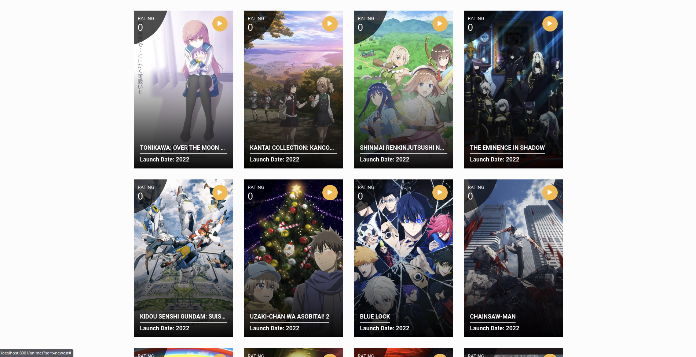

# Anime Streaming Project

## Description

This project is a web application that allows users to list and explore animes available for streaming. It provides a feature-rich experience for discovering, sorting, and filtering animes according to user preferences. The application also includes an intuitive user interface to display detailed information about specific animes, available episodes, and genre-based recommendations.

## Main Features

- **Anime Listing**: Browse a vast collection of animes sorted by popularity, release date, format, status, etc.
- **Advanced Filter System**:
    - Search by anime title.
    - Filter by format (TV, OVA, Movie, etc.).
    - Filter by status (ongoing, completed, etc.).
    - Sort by release year or genre.
- **Anime Details**: Display detailed information about an anime, such as genres, episodes, release dates, etc.
- **Available Episodes**: Easily access episodes with an intuitive navigation system.
- **Personalized Recommendations**: Get recommendations for similar animes based on the last genre displayed.
- **Custom Homepage**: A homepage highlighting top-rated animes, the latest releases, and new entries for special formats such as movies and OVAs.

## Controller Structure

1. **AnimeController**:
    - Handles the display of detailed information about specific animes.
    - Enables navigation between episodes.
    - Provides genre-based recommendations.

2. **AnimeFilterController**:
    - Implements an advanced filter system for anime listings.
    - Allows sorting animes by title, format, status, year, or genre.
    - Provides paginated results for smooth navigation.

3. **HomeController**:
    - Manages the homepage.
    - Displays top-rated animes, the latest releases, and updates for special formats.

## Data Model

- **Anime**:
    - Contains main information about each anime (title, genres, format, status, etc.).
    - Has relationships with episodes and genres.

- **Genre**:
    - Lists and categorizes genres for each anime.

- **Episodes**:
    - Stores information about an anime's episodes (number, title, release date).

## Services

- **AnimeService**: Provides the necessary methods to interact with the anime database, such as fetching animes by genre, status, or title.
- **GenreService**: Manages interactions with genre data.

## Prerequisites

- PHP 8.3
- Laravel Framework
- Relational database (e.g., MySQL)
- Composer for dependency management

## Overview

Here is a preview of the application:

